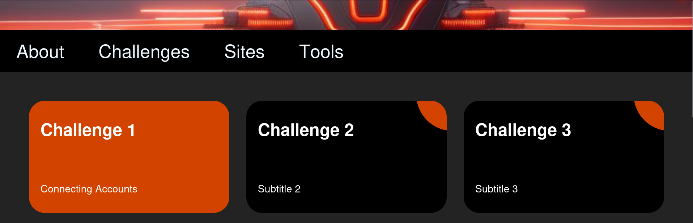
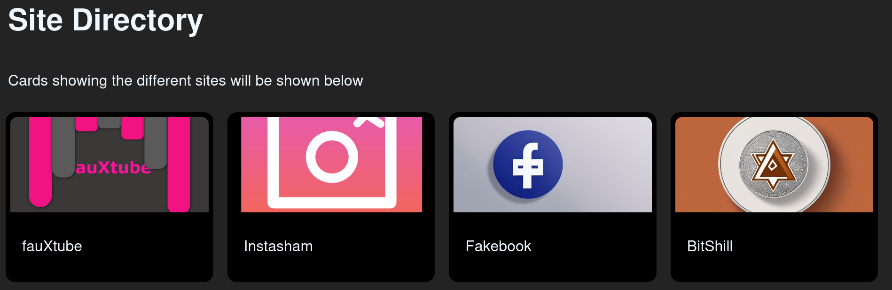

# OSINT-Playground
Welcome to OSINT-playground! A training environment to help learn about open source intelligence gathering (OSINT) techniques.

This project is being undertaken as part of a capstone course and will be focused on developing a self-contained learning environment that can help demonstrate not just the importance of protecting yourself online, but also tools and techniques used in the field of OSINT.

## Installation

The environment can be installed and run in two ways:
- Using Docker
- Cloning the repo and then running the `app.py` file using python in a terminal

### Docker 🐳
Docker should already be installed before attempting the following steps. You can find install instructions [here](https://docs.docker.com/engine/install/) if you do not currently have Docker installed.
- Clone the repo: `git clone https://github.com/b1p01arC0nf1d3nc3/OSINT-playground/`
- Change into the `OSINT-playground` directory
- Run `sudo docker image build -t playground .`
- Run `sudo docker run -d -p 5000:5000 playground`
The homepage should now be accessible at `localhost:5000`.

### Cloning the repo
If you choose to clone the repo and run the python application directly, the `app.py` file can be found in the `code` directory. Simply open a terminal, change directory to the `code` directory, and then run the tool using `python app.py`. Note: You may be required to install Flask if you have not already done so. This can be done by using `pip install -r requirements.txt` from within the `code` directory.

## How to Use OSINT-playground

Once up and running, navigate to localhost:5000 in a web browser to be taken to the homepage. Here, a more detailed description of the tool and the available challenges is provided.

In essence, the tool provides a range of mock websites that mimic various types of websites that would be used in an investigation. Currently, only two prototypes are available (fauXtube, a mock version of YouTube, and Instasham, a mock version of Instagram). The `Challenges` page allows users to select which investigation to try, while the `Tools` page provides a list of useful sites/utilities.

If you want to explore the different mock sites, navigate to the 'Sites' page, which presents cards that will redirect you to the relevant site.

